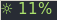

# brightness

>A blocklet for i3blocks that shows your screen's brightness.



## Features

* Displays the current screen brightness, using `xbacklight`.
* Scrolling with the mouse over the block will change the brightness.
* Displays an integer value by default, but can be configured to display two
  decimal places with the `--long` flag.
* Can be configured to update at a set interval, or only when the brightness
  changes.

## Dependencies

`xbacklight`, a brightness tool. You may also wish to install `fonts-font-awesome`
to use a symbol for the label.

## Installation & Usage

Add the configuration (below) into your i3blocks configuration file.

### Option 1: Update only when the brightness changes

The following is a recommended config (use the `--long` flag to display the
brightness to two decimal places; leave it off to display an integer):

```sh
[brightness]
command=$SCRIPT_DIR/brightness [--long]
label=☼
interval=once
signal=12
```

You should also add the following lines to your i3 config file (or update your
existing brightness bindings to include `&& pkill -RTMIN+12 i3blocks`):

```sh
# Change backlight
bindsym XF86MonBrightnessUp exec xbacklight +2 && pkill -RTMIN+12 i3blocks
bindsym XF86MonBrightnessDown exec xbacklight -2 && pkill -RTMIN+12 i3blocks
```

### Option 2: Update at a set interval

If you would prefer for it to update at a set interval, then set `interval=` to
the number of seconds between updates.

```sh
[brightness]
command=$SCRIPT_DIR/brightness [--long]
label=☼
interval=5
```
